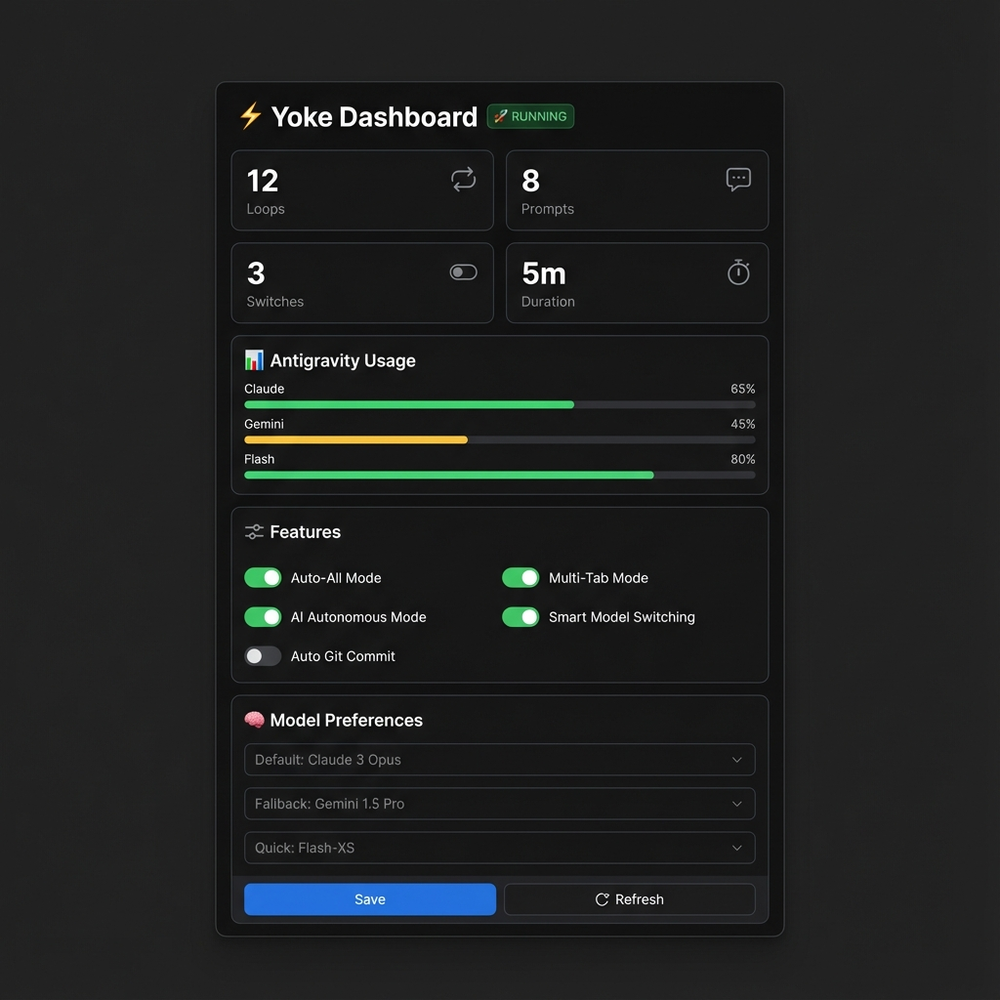

<div align="center">
  

  # Yoke AntiGravity

  **Transform Antigravity into a fully autonomous AI development environment.**

  Stop clicking "Accept" – let AI code for you while you focus on what matters.

  [](https://marketplace.visualstudio.com/items?itemName=ai-dev-2024.yoke-antigravity)
  [](https://open-vsx.org/extension/ai-dev-2024/yoke-antigravity)
  [](https://marketplace.visualstudio.com/items?itemName=ai-dev-2024.yoke-antigravity)
  [](https://github.com/ai-dev-2024/yoke-antigravity/stargazers)
  [](LICENSE)

  [Features](#features) • [Installation](#installation) • [Usage](#usage) • [Configuration](#configuration) • [Support](#support)
</div>

---

## 📸 Dashboard Preview

<div align="center">
  
  <p><em>Sleek, modern dashboard for controlling all autonomous features</em></p>
</div>

---

## 🚀 Overview

Yoke Antigravity connects directly to the Antigravity editor's internal systems, unlocking true autonomy. By bridging the gap between the editor's capabilities and AI models, Yoke enables features like **Auto-All** (zero-click acceptance), **Multi-Tab** (parallel workflows), and the **Autonomous Loop** for self-directed development.

### 🔗 Install Now

| Platform | Link |
|----------|------|
| **VS Code Marketplace** | [Install from Marketplace](https://marketplace.visualstudio.com/items?itemName=ai-dev-2024.yoke-antigravity) |
| **Open VSX** | [Install from Open VSX](https://open-vsx.org/extension/ai-dev-2024/yoke-antigravity) |
| **GitHub Releases** | [Download VSIX](https://github.com/ai-dev-2024/yoke-antigravity/releases) |

---

## ✨ Features

### 🚀 Auto-All Mode
**Zero-friction development.** Automatically accepts file edits, terminal commands, and prompts via deep CDP integration.
- ✅ Works reliably across Antigravity
- 🛡️ Banned command filtering for safety
- ⚡ Background operation with web workers

### 📑 Multi-Tab Mode
**Parallelize your productivity.** Work across all conversation tabs simultaneously.
- 🔄 Automatic tab rotation
- 📊 Progress tracking per conversation
- 🖥️ Visual overlay in background mode

### ⚡ AI Autonomous Mode
**The future of AI coding.** Continuous AI development loop with intelligent model selection.
- 🤖 **Reasoning** with Claude Opus 4.5
- 🎨 **Frontend** with Gemini 3 Pro
- ⚡ **Speed** with Gemini 3 Flash
- 🛑 Circuit breaker & recovery strategies

### 📊 Settings Dashboard
**Full control.** Visual configuration panel to toggle features, set model preferences, and view session stats.

---

## 📦 Installation

### From VS Code Marketplace (Recommended)
Search for **"Yoke AntiGravity"** in VS Code Extensions, or [click here to install](https://marketplace.visualstudio.com/items?itemName=ai-dev-2024.yoke-antigravity).

### From VSIX
1. Download the latest `.vsix` from [Releases](https://github.com/ai-dev-2024/yoke-antigravity/releases)
2. In Antigravity: `Cmd/Ctrl+Shift+P` → "Extensions: Install from VSIX..."
3. Select the downloaded file

### From Source
```bash
git clone https://github.com/ai-dev-2024/yoke-antigravity.git
cd yoke-antigravity
npm install
npm run compile
npm run package
```


---

## 🎮 Usage

### Status Bar
Click the status bar items to toggle features instantly:
- **Auto-All**: Toggle auto-accept (✅ Ready)
- **Multi-Tab**: Toggle parallel mode (✅ Ready)
- **Yoke**: Start autonomous loop (🚧 Beta)
- **⚙️**: Open Dashboard

### Dashboard
Access via `Yoke: Open Dashboard` in the Command Palette.
- Configure feature toggles and model preferences
- View real-time session statistics
- Manage banned commands

---

## 🏗️ Architecture

```
src/
├── core/               # Business logic
│   ├── autonomous-loop.ts    # Main autonomous loop
│   ├── circuit-breaker.ts    # Safety mechanism
│   ├── model-selector.ts     # Intelligent routing
│   └── task-analyzer.ts      # Context awareness
├── providers/          # External integrations
│   ├── cdp-client.ts         # Chrome DevTools Protocol
│   └── antigravity-usage.ts  # Usage scraping
├── ui/                 # User interface
│   ├── dashboard.ts          # key webviews
│   └── status-bar.ts         # extensive status bar controls
└── main_scripts/       # Injection scripts
    ├── cdp-handler.js        # Core auto-accept logic
    └── full_cdp_script.js    # Browser injection
```

---

## ⚙️ Configuration

| Setting | Default | Description |
|---------|---------|-------------|
| `yoke.autoAllEnabled` | `false` | Enable Auto-accept mode |
| `yoke.multiTabEnabled` | `false` | Enable Multi-tab background work |
| `yoke.yokeModeEnabled` | `false` | Enable Autonomous loop |
| `yoke.preferredModelForReasoning` | `claude-opus-4.5` | Model for complex logic |
| `yoke.preferredModelForFrontend` | `gemini-3-pro` | Model for UI/CSS tasks |

---

## 🌟 Star History

[](https://star-history.com/#ai-dev-2024/yoke-antigravity&Date)

---

## 🤝 Contributing

We welcome contributions! Please fork the repository and submit a Pull Request.

1. Fork the Project
2. Create your Feature Branch
3. Commit your Changes
4. Push to the Branch
5. Open a Pull Request

---

## 📄 License

Distributed under the MIT License. See [LICENSE](LICENSE) for more information.

---

<div align="center">
  <h3>💖 Support the Project</h3>
  <p>If Yoke saves you time, consider buying us a coffee.</p>
  <a href="https://ko-fi.com/ai_dev_2024">
    
  </a>
</div>
